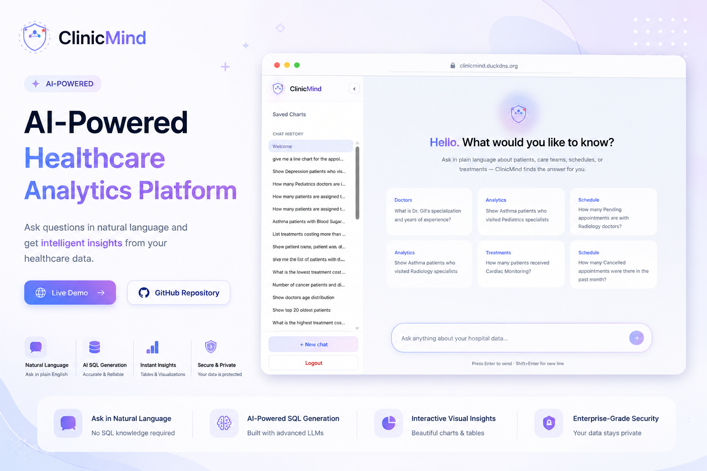
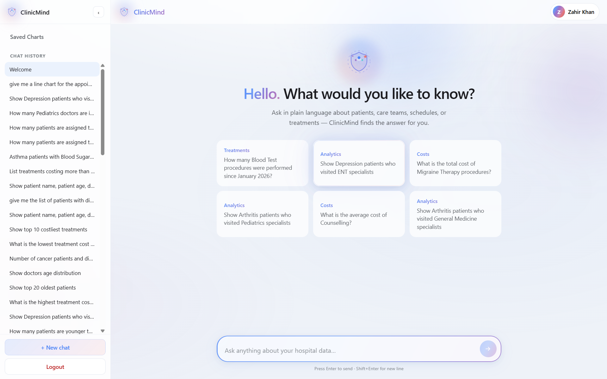
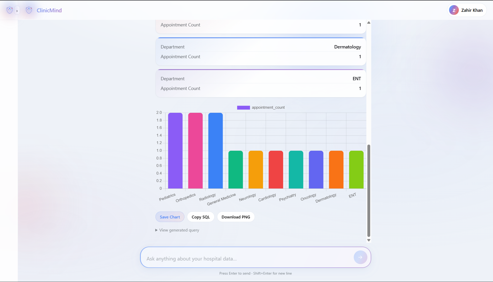

 

# ClinicMind

### AI-Powered Healthcare Analytics Platform

Transform natural language into meaningful healthcare insights.

 

  <a href="https://clinicmind.duckdns.org">🌐 Live Demo</a>

---
## The Problem

Healthcare organizations generate vast amounts of patient, appointment, treatment, and operational data every day. While this information holds valuable insights, accessing it often requires SQL knowledge and technical expertise.

Hospital administrators and healthcare professionals frequently depend on technical teams to retrieve reports, answer operational questions, or generate visualizations. This process can be time-consuming, inefficient, and limits quick decision-making.

As healthcare data continues to grow, there is a need for an intuitive solution that allows non-technical users to interact with complex databases effortlessly.

## The Solution

ClinicMind is an AI-powered healthcare analytics platform that enables users to query healthcare databases using natural language.

Instead of writing SQL queries, users simply ask questions in plain English. ClinicMind intelligently converts those requests into optimized PostgreSQL queries, retrieves the relevant data, and presents the results through structured tables and interactive visualizations.

By combining Large Language Models, semantic caching, and modern web technologies, ClinicMind makes healthcare analytics faster, more accessible, and easier for non-technical users.

## Product Preview

### 🏠 Landing Experience

Ask healthcare questions in natural language through a clean, conversational interface designed for healthcare professionals.

  

---

### 💬 Conversational Analytics

ClinicMind converts natural language questions into optimized SQL queries and presents structured results instantly.

  

---

### 📊 Interactive Visualizations

Generate charts directly from query results, making healthcare trends easier to understand and analyze.

  

