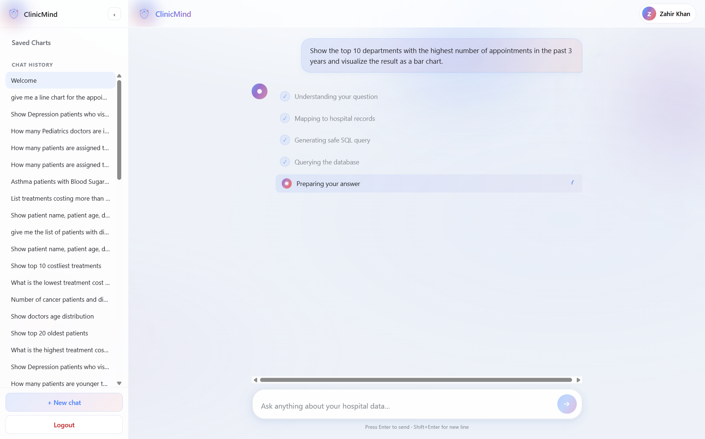
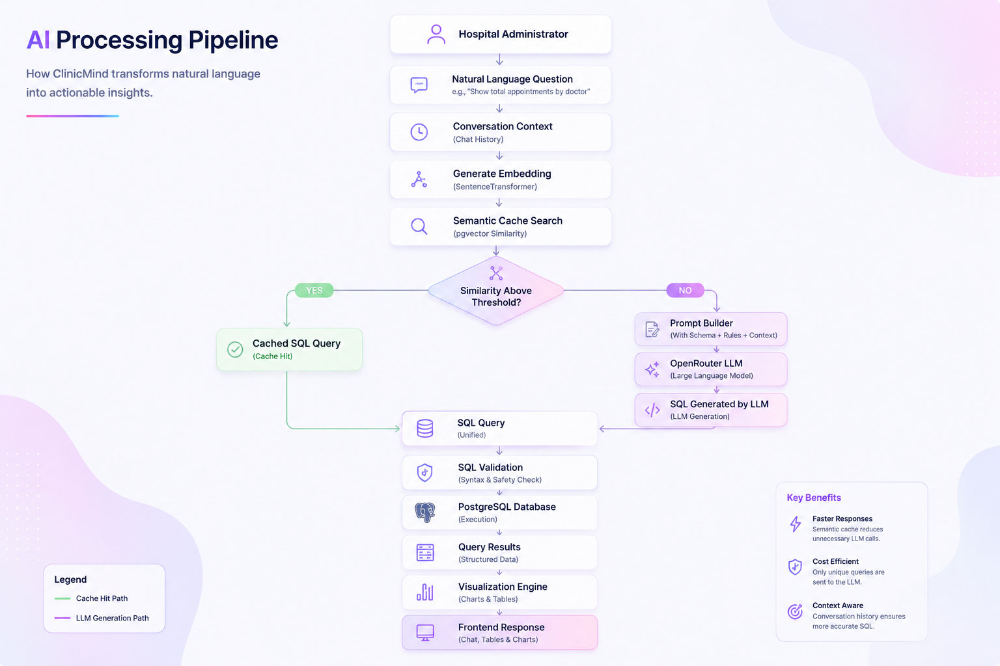
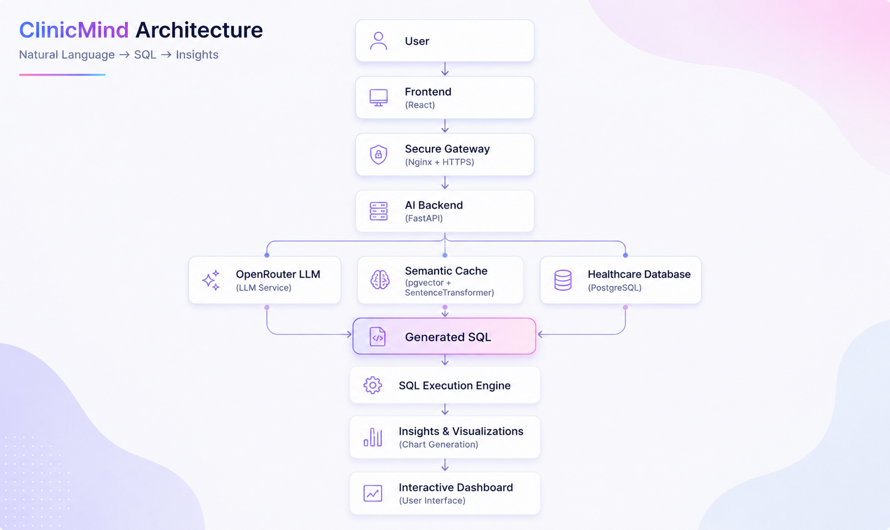
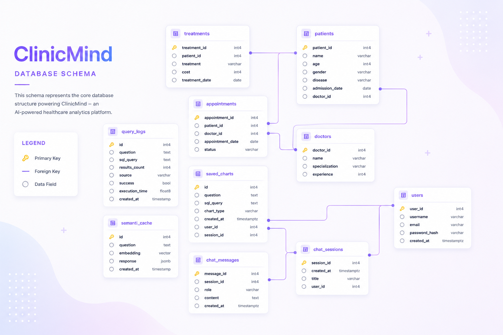

 

# ClinicMind

### AI-Powered Healthcare Analytics Platform

Transform natural language into meaningful healthcare insights.

 

  <a href="https://clinicmind.duckdns.org">🌐 Live Demo</a>

---
## The Problem

Healthcare organizations generate vast amounts of patient, appointment, treatment, and operational data every day. While this information holds valuable insights, accessing it often requires SQL knowledge and technical expertise.

Hospital administrators and healthcare professionals frequently depend on technical teams to retrieve reports, answer operational questions, or generate visualizations. This process can be time-consuming, inefficient, and limits quick decision-making.

As healthcare data continues to grow, there is a need for an intuitive solution that allows non-technical users to interact with complex databases effortlessly.

## The Solution

ClinicMind is an AI-powered healthcare analytics platform that enables users to query healthcare databases using natural language.

Instead of writing SQL queries, users simply ask questions in plain English. ClinicMind intelligently converts those requests into optimized PostgreSQL queries, retrieves the relevant data, and presents the results through structured tables and interactive visualizations.

By combining Large Language Models, semantic caching, and modern web technologies, ClinicMind makes healthcare analytics faster, more accessible, and easier for non-technical users.

## Product Preview

### 🏠 Landing Experience

Ask healthcare questions in natural language through a clean, conversational interface designed for healthcare professionals.

  

---

### 💬 Conversational Analytics

ClinicMind converts natural language questions into optimized SQL queries and presents structured results instantly.

  

---

### 📊 Interactive Visualizations

Generate charts directly from query results, making healthcare trends easier to understand and analyze.

  

---

# ✨ Key Features

ClinicMind combines Artificial Intelligence, Natural Language Processing, and modern web technologies to simplify healthcare data analytics.

| Feature | Description |
|---------|-------------|
| 💬 Natural Language Queries | Ask healthcare questions in plain English without writing SQL. |
| 🤖 AI SQL Generation | Converts user questions into optimized PostgreSQL queries using a Large Language Model. |
| 📊 Automatic Visualizations | Generates interactive charts from SQL results with a single request. |
| 🧠 Semantic Cache | Uses SentenceTransformer embeddings to detect similar questions and avoid unnecessary LLM calls. |
| 💾 Chat History | Stores conversations for contextual follow-up questions. |
| 📈 Saved Charts | Save generated charts for future reference. |
| ⚡ FastAPI Backend | High-performance REST API for query processing and chart generation. |
| 🗄 PostgreSQL Database | Structured healthcare dataset with relational schema. |
| 🔐 Authentication | Secure login and user-specific chat sessions. |
| ☁ Cloud Deployment | Deployed on Oracle Cloud Infrastructure using Nginx and HTTPS. |

---

---

# 🧠 AI Processing Pipeline

ClinicMind transforms natural language into meaningful healthcare insights through a multi-stage AI workflow. Instead of directly generating SQL for every request, the platform first checks a semantic cache to reuse previously generated queries whenever possible, reducing latency and unnecessary LLM calls.

If no similar query is found, the request is sent to the Large Language Model, which generates an optimized PostgreSQL query. The query is then executed against the healthcare database, and the results are returned as structured tables or interactive visualizations.

  

---

# 🏗️ System Architecture

ClinicMind follows a modern client-server architecture built around FastAPI, PostgreSQL, and Large Language Models. The frontend communicates securely with the backend through Nginx, while AI-powered SQL generation is handled through OpenRouter. Semantic caching minimizes repeated LLM requests, improving both response time and operational efficiency.

  

---

# 🗄️ Database Schema

The healthcare database is designed using a normalized relational schema that models patients, doctors, appointments, treatments, chat sessions, and generated visualizations. Relationships between entities ensure efficient querying while supporting conversational healthcare analytics.

  

---

# 🛠 Technology Stack

| Category | Technologies |
|----------|--------------|
| **Frontend** | React, TypeScript, Tailwind CSS, Chart.js |
| **Backend** | Python, FastAPI, SQLAlchemy, Pydantic |
| **Large Language Model** | DeepSeek Chat (via OpenRouter) |
| **AI & NLP** | SentenceTransformers (`all-MiniLM-L6-v2`), Semantic Similarity Search |
| **Semantic Caching** | pgvector, Vector Embeddings, Cosine Similarity |
| **Database** | PostgreSQL, Supabase |
| **Authentication** | JWT Authentication |
| **Cloud & Deployment** | Oracle Cloud Infrastructure (OCI), Ubuntu Server, Nginx, DuckDNS |
| **Version Control** | Git, GitHub |
| **Development Tools** | VS Code, Postman, Swagger UI |

---

### Core Concepts Demonstrated

- Natural Language to SQL (NL2SQL)
- Prompt Engineering
- Conversational AI
- Context-Aware Chat History
- Semantic Caching
- Vector Embeddings
- Retrieval using Cosine Similarity
- PostgreSQL Query Optimization
- Data Visualization
- REST API Development
- Cloud Deployment

### AI Components

- DeepSeek Chat (LLM)
- OpenRouter API
- SentenceTransformer Embeddings
- all-MiniLM-L6-v2
- Semantic Cache
- pgvector
- Cosine Similarity Search
- Prompt Engineering
- Context-Aware Conversations

---

# ☁ Deployment

ClinicMind is deployed on Oracle Cloud Infrastructure (OCI) using an Ubuntu virtual machine. Nginx serves as the reverse proxy, securely forwarding requests to the FastAPI backend. PostgreSQL is hosted on Supabase, while OpenRouter provides access to the Large Language Model used for SQL generation.

### Deployment Highlights

- Oracle Cloud Infrastructure (OCI)
- Ubuntu Server
- Nginx Reverse Proxy
- FastAPI Backend
- PostgreSQL (Supabase)
- HTTPS with DuckDNS
- OpenRouter API Integration

---

# 🛣 Roadmap

### Completed

- [x] Natural Language to SQL
- [x] AI-powered SQL Generation
- [x] Semantic Cache
- [x] Conversational Chat Sessions
- [x] Interactive Chart Generation
- [x] Saved Charts
- [x] Oracle Cloud Deployment
- [x] GitHub Product Showcase

### Planned

- [ ] Role-Based Access Control (RBAC)
- [ ] Export Reports (PDF / Excel)
- [ ] Voice-Based Querying
- [ ] Multi-Database Support
- [ ] Advanced Healthcare Analytics Dashboard
- [ ] AI Insights & Recommendations

---

---

# 📦 Source Code Availability

ClinicMind is an actively evolving AI product, and the complete source code is maintained in a private repository.

This repository has been intentionally created as a public product showcase to highlight the platform's architecture, AI workflow, database design, deployment strategy, and engineering decisions without exposing the proprietary implementation.

The focus of this showcase is to demonstrate how ClinicMind was designed, engineered, and deployed rather than to distribute the production source code.

If you're a recruiter, interviewer, researcher, or potential collaborator interested in discussing the technical implementation, feel free to connect with me.

## 👨‍💻 Developer

**Mohd Zahir Khan**

Final Year Data Science Student

Aspiring AI Product Developer

---

> *ClinicMind demonstrates how Artificial Intelligence can bridge the gap between natural language and structured healthcare data, enabling faster, more accessible, and insight-driven decision-making.*
